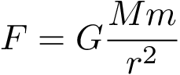

<section>

	
Eine der großen Leistungen Newtons bestand in der Entdeckung eines allgemeinen Gesetzes der Gravitation. Dieses besagt, dass jeder Massenpunkt im Universum jeden anderen Massenpunkt mit einer Kraft F anzieht, die proportional zum Produkt ihrer Massen M und m und antiproportional zum Quadrat ihres Abstands r ist:

	

		<table>
			<tbody>
				<tr>
					<td></td>
					<td>Newtonsches Gravitationsgesetz</td>
				</tr>
			</tbody>
		</table>
	

	
Die zugehörige Proportionalitätskonstante wird als Newtonsche Gravitationskonstante G bezeichnet. Sie ist die einzige fundamentale Naturkonstante, die in dieser Theorie und damit in dieser Ecke des Würfels berücksichtigt wird. In Kombination mit der Newtonschen Mechanik der Ecke (0, 0, 0) kann man mit dieser Theorie in erstaunlicher Genauigkeit sowohl das Herunterfallen von Objekten auf der Erde, als auch das ›Herumfallen‹ von Himmelsobjekten wie Monden, Planeten, Meteoriten und Satelliten im Planetensystem beschreiben.

	

	<h4>Newtonsche Gravitationstheorie</h4>

	
Newtonsche Gravitationstheorie Im dritten Buch »De mundi systemate« seiner »Philosophiae Naturalis Principia Mathematica« führt Isaac Newton die Bewegung der Planeten und ihrer Satelliten auf die Wirkung einer universellen Gravitation zurück. Diese Kraft hält die Objekte des Himmels in ihrer Bahn, schreibt Newton, und verhält sich umgekehrt proportional zum Quadrat des Abstandes zum Schwerpunkt der Sonne bzw. des jeweiligen Planeten. Aber auch die Masse spielte dabei eine wesentliche Rolle: »Wenn die Materie zweier Kugeln, die zueinander hin wechselseitig Schwere zeigen, in den Bereichen, die vom Mittelpunkt gleichen Abstand haben, homogen ist, so wird sich das Gewicht jeder Kugel zur anderen umgekehrt wie das Quadrat des Abstandes zwischen ihren Mittelpunkten verhalten.« (Newton 1687) Das Gravitationsgesetz gilt also, was jedoch erst von Leonhard Euler klar gefasst wurde, nicht nur für Punktmassen, sondern lässt sich auf die Schwerpunkte von ausgedehnten Körpern übertragen. In moderner Form ausgedrückt lautet das Gravitationsgesetz:

Ein integraler Bestandteil von Newtons Gravitationstheorie ist das schwache Äquivalenzprinzip. Dieses besagt, dass träge und schwere Masse eines jeden Körpers identisch sind. Bereits Galileo hatte erkannt, dass alle Körper daher gleich schnell fallen. Den notwendigen Beweis für diese Äquivalenz lieferte Newton experimentell mit einem speziellen Paar von Pendeln. Bis heute wird diese Äquivalenz mit höchst komplexen Experimenten erforscht. Eine Abweichung zwischen schwerer und träger Masse hat sich dabei noch nie offenbart. Besonders eindrucksvoll demonstrierte die Mondmission Apollo 15, wie eine Feder und ein Hammer gleich schnell fallen.
Für Newton besaß das Gravitationsgesetz allerdings einen ausschließlich relationalen Charakter, er kannte keinen numerischen Wert für die Gravitationskonstante G. Doch auch aus der Proportionalität der universellen Gravitation leitete er epochale Konsequenzen ab – zuvorderst, dass jedes Binärsystem aus Sonne und Planet eine elliptische Umlaufbahn um die Sonne zur Folge hat, in deren einem Fokus die Sonne liegt. Newton formulierte damit eine dynamische und mathematische Herleitung für die bereits empirisch bekannte Bahn von Planeten: »whereas Kepler guessed right at the Ellipsis«. (Newton an Halley 1686) Trotz der revolutionären Erfolge blieb für viele Zeitgenossen Newtons der Charakter der instantanen Fernwirkung in seinem Gravitationsgesetz äußerst fragwürdig.
Die Einführung der fundamentalen Naturkonstante G für die Wechselwirkung der Gravitation findet damit historisch besehen innerhalb der Theoriebildung Newtons statt. Systematisch jedoch definiert sie die erste Achse im Würfelmodell der Physik, eine neue Seite des Oktaeders (G, 0, 0).
Erst ein gutes Jahrhundert nach Newton konnte Henry Cavendish 1798 experimentell einen Wert für die Dichte der Erde bestimmen, aus dem indirekt auch G berechnet werden kann. Aber auch ohne einen numerischen Wert für die Konstante im Kraftgesetz hatte Newton weitere Schlüsse aus der Proportionalität gezogen. So folgerte er beispielsweise, dass »sich Gewichte in beliebigen anderen Bereichen der ganzen Oberfläche der Erde umgekehrt wie die Abstände ihrer Orte vom Erdmittelpunkt« verhalten (Newton 1687), wodurch sich Rückschlüsse auf die Form der Erde selbst anstellen ließen.

</section>
